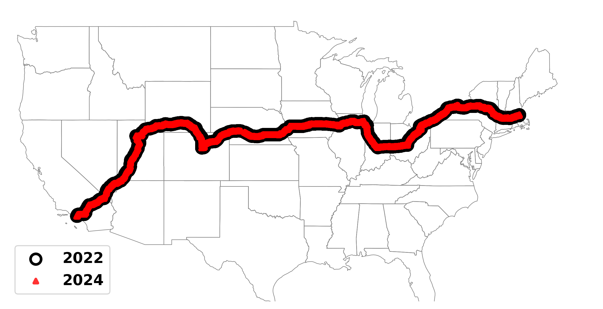

# [IMC '25] Replication: Performance of Cellular Networks on the Wheels

In this repository, we release the dataset and scripts used in the IMC '25
paper, *Replication: Performance of Cellular Networks on the Wheels*.

<p align="center">

</p>

**Authors**:
[[Moinak Ghoshal](https://sites.google.com/view/moinak-ghoshal/home)] 
[[Omar Basit]([https://sites.google.com/view/moinak-ghoshal/home](https://scholar.google.com/citations?user=O8YhcToAAAAJ&hl=en))] 
[[Imran Khan](https://imranbuet63.github.io)]
[[Z. Jonny Kong](https://www.jonnykong.com)]
[[Sizhe Wang]([https://scholar.google.com/citations?user=87M0_7EAAAAJ&hl=en](https://sizhewang.cn))]
[[Yufei Feng]([https://scholar.google.com/citations?user=87M0_7EAAAAJ&hl=en](https://www.linkedin.com/in/yufei-feng-7b268820b))]
[[Phuc Dinh](https://scholar.google.com/citations?user=87M0_7EAAAAJ&hl=en)]
[[Y. Charlie Hu](https://engineering.purdue.edu/~ychu/)]
[[Dimitrios Koutsonikolas](https://ece.northeastern.edu/fac-ece/dkoutsonikolas/)]


<!-- ## Datasets

The dataset involves several tasks/applications with different experimental
methodologies and data formats, each organized into a sub-folder. Please click
on the link to each subfolder for more details:

| Task | Subfolder |
| :--- | :---: |
| Coverage/Throughput/RTT/Handovers | [throughput_rtt_coverage_ho](./throughput_rtt_coverage_ho) |
| Augmented Reality (AR) and Connected Autonomous Vehicle (CAV) | [ar_cav](./ar_cav) |
| Video Streaming | [360video](./360video)   |
| Cloud Gaming | [cloud_gaming](./cloud_gaming) | 
-->

```
Note: Use "git lfs pull" to get all the files
```
## References

Please cite appropriately if you find the dataset useful.

```
@article{ghoshal2025performance,
  title={Replication: Performance of Cellular Networks on the Wheels},
  author={Ghoshal, Moinak and Basit, Omar and Khan, Imran and Kong, Z Jonny and Wang, Sizhe and Feng, Yufei and Dinh, Phuc and Hu, Y Charlie and Koutsonikolas, Dimitrios},
  booktitle={Proceedings of the 25th ACM Internet Measurement Conference},
  year={2025}
}
```

If there are any questions, feel free to contact us
([ghoshal.m@northeastern.edu](ghoshal.m@northeastern.edu)).
